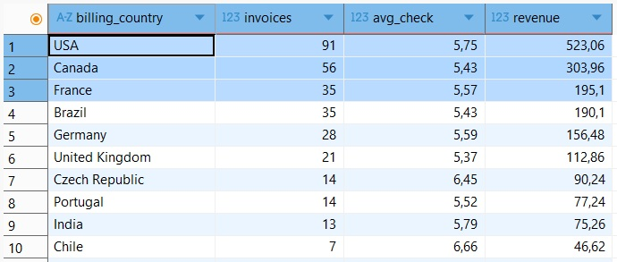
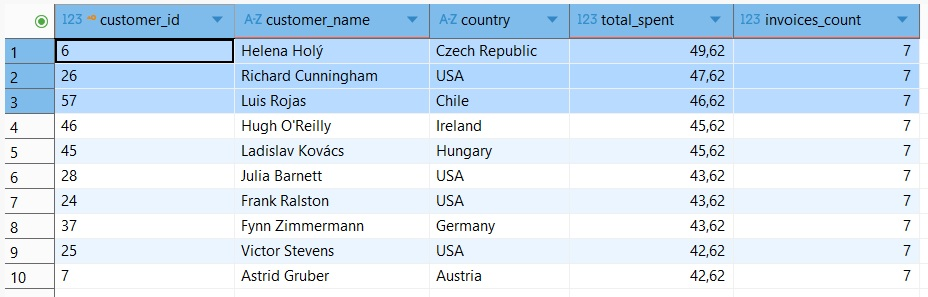
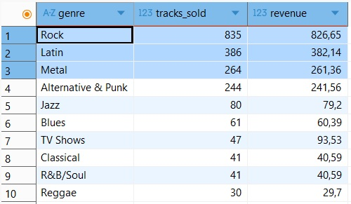

# SQL Product Analytics — Digital Media Platform

## Описание проекта
SQL-анализ базы данных цифрового медиа-сервиса (на примере Chinook).  
Проект имитирует задачи Product Analyst / Data Analyst в крупных стриминговых сервисах.

**Основные направления анализа:**
- Выручка и средний чек
- Поведение клиентов
- Эффективность сотрудников поддержки
- Популярность контента (жанры и треки)
- География продаж

## Данные
- Источник: [Chinook Database](https://github.com/lerocha/chinook-database/releases)
- Клиентов: 59
- Треков: 3 503
- Инвойсов: 412
- Период: с 2021 по 2025 год включительно

## Инструменты
- PostgreSQL
- DBeaver
- SQL (JOIN, GROUP BY, CTE, агрегатные функции)

## Скриншоты

### Средний чек и количество покупок по странам


### Топ-10 клиентов по выручке


### Самые популярные жанры по количеству проданных треков


## Ключевые инсайты

- **Общая выручка:** $2 328.60
- **Средний чек:** $5.65
- **Топ стран по выручке:** USA, Canada, France
- **Самый популярный жанр:** Rock (835 продаж, $826.65)
- **Все клиенты** в базе — повторные (one-time покупателей нет)
- Лучшие сотрудники поддержки по выручке: Jane Peacock, Margaret Park, Steve Johnson

## Структура проекта
```
02-sql-product-analytics/
├── sql/
│   ├── 01_basic_exploration.sql
│   ├── 02_business_questions.sql
│   ├── 03_advanced_analysis.sql
│   └── 04_final_insights.sql
├── data/
├── images/
├── README.md
└── .gitignore
```

## Основные запросы
В папке `sql/` находятся все запросы, разбитые по логическим блокам:
- Базовое исследование данных
- Бизнес-метрики (выручка, клиенты, страны)
- Анализ сотрудников и повторных покупок
- Анализ контента и динамика по времени

## Как воспроизвести
1. Установите PostgreSQL и DBeaver
2. Создайте базу данных `chinook_analytics`
3. Выполните скрипт `Chinook_PostgreSql.sql`
4. Откройте SQL-файлы из папки `sql/` и выполняйте запросы

## Автор
Veta Suhih | Junior Data Analyst  
GitHub: [veta-suhih](https://github.com/veta-suhih) | LinkedIn: [vetasuhih](www.linkedin.com/in/vetasuhih)